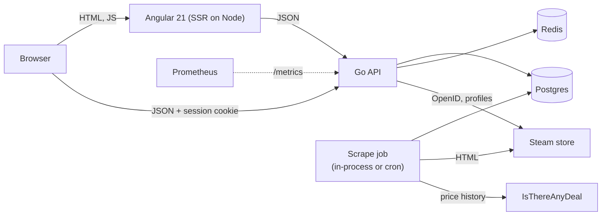

# Steamscope


Steamscope tracks the prices of Steam games and bundles over time. It scrapes the Steam store daily, backfills up
to two years of price history from [IsThereAnyDeal](https://isthereanydeal.com/), and presents it through a
searchable catalogue with price charts, watchlists, price-drop notifications and a moderated submission queue.

## Features

**For visitors**
- Browse and search games by name, genre, tag, developer, publisher, language, price range and minimum discount.
- Game pages with sanitized store descriptions, reviews and a price-history chart (1 week to 2 years).
- A "Buy now or wait?" call for every game: a two-year price forecast (chance of a lower price, expected prices, when the
  next sale is likely) and a verdict with the reasons behind it. Watchers get advice that also weighs their target price
  and how long they have been waiting. See [docs/PREDICTIONS.md](docs/PREDICTIONS.md).
- Bundle tracking: bundles are discovered from tracked games' store pages (and can be submitted by link), with
  years of price history imported from ITAD, the same forecast and buy-now-or-wait advice as games, a verdict on
  whether the bundle beats buying its games separately, and a cover collage built from the games they contain.

**For signed-in users**
- Email-and-password accounts, plus "Sign in through Steam" (OpenID) and Steam profile cards.
- A personal feed: watchlist (with pinning and target prices), games below their usual price, suggestions, recently
  played games from a linked Steam account (with a one-click "Track price" request) and a wishlist import (see below) and in-app notifications.
- Suggest games or bundles for tracking by pasting a Steam store link. Suggestions go through admin approval
  before anything is scraped.

**For administrators**
- A dashboard with user activity and statistics (most watched, most pinned, top submitters, 14-day activity).
- Approve, reject or delete submitted games and bundles; ban users or block their submissions.
- A blacklist of rules (exact app ID, or regular expressions on game name, developer or publisher) with a preview
  of which existing games a rule would remove.

**Operations**
- Liveness and readiness probes, Prometheus metrics, request IDs on every response and structured JSON access logs.
- Automated tests, a GitHub Actions pipeline, Dockerfiles and a ready-made daily scrape job (cron, systemd or
  Windows Task Scheduler).

## Wishlist import

On the feed page, just under the Steam profile card, **Import wishlist** reads the linked account's Steam wishlist and starts
watching every game on it that Steamscope already has (games already watched keep their pin and target price).

Games Steamscope does not have are listed in a dialog. The user chooses which to request and, for each, whether to **pin** it
to the top of their feed. Requests go through the normal submission queue, so an admin approves them first (admins' own
requests are scraped straight away). The choice is remembered in `wishlist_requests`; when a requested game is added, the user
starts watching it automatically, pinned if they chose that. If the game is turned down, deleted or not found, the request is
dropped. Games someone else has already requested are followed the same way, without asking an admin again.

Once every game on the wishlist is imported the button is replaced by "All your wishlist games are imported", and while
requested games are still being added it says how many are waiting, and checks again every 20 seconds so it flips to "all
imported" by itself once they are added. `GET /me/wishlist/status` answers this without changing anything. Only Steam's list of
wishlist games is cached (for five minutes); how those games stand against Steamscope's data and the user's watchlist is worked
out on every call, so a deleted, added or newly watched game shows at once. A game added to the wishlist later brings the button
back.

- The wishlist must be public. Steam reports a private wishlist as empty, so the two look the same.
- Importing is limited to 6 times an hour per user and requesting to 3 (checking the status, 60), since each call reaches Steam or
  an admin queue. A request takes at most 100 games and only accepts games that really are on the user's wishlist.
- Games turned down by an admin or blocked by the blacklist are counted but never offered again, and do not stop the wishlist
  counting as imported.
- A game deleted from the database by hand leaves a "tracked" row behind. It is treated as missing, offered again, and can be
  requested again (by import or by submitting its link).

## Target-price alerts

Besides the in-app notification, a user can ask to be told when a game they watch reaches its target price by **email**,
**Discord** or a **browser notification**. They are three checkboxes under Account, Preferences, each off by default; a test
button next to each sends a sample so the user can see it works before relying on it. They are saved with the rest of the
preferences, and apply only to target prices (a game dropping a few percent is still in-app only).

- **Email** goes to the address on the account. It needs an SMTP server (`SMTP_HOST`, `SMTP_FROM`, and usually a username and
  password); without one the option shows as "not set up on this server".
- **Discord** takes the user's own webhook URL (channel settings, Integrations, Webhooks). Only real `discord.com` webhook
  addresses are accepted, because the server sends requests to whatever the user enters. Messages cannot ping anyone. A webhook
  that Discord says no longer exists switches the option off by itself.
- **Browser notification** uses web push. Run `go run ./backend/cmd/vapid` once and put the keys in `.env`. Ticking the box asks
  the browser for permission and subscribes that browser (several browsers can be subscribed); a browser that has unsubscribed
  is forgotten when a push to it fails with 404 or 410.

Alerts are sent by the scrape, when the price that crosses the target is recorded, so a user hears about it once per day at most.
One channel failing never stops the others or the scrape. Banned users get no outside alerts.

## Architecture



| Layer | Technology |
| --- | --- |
| Frontend | Angular 21 (standalone components, signals, SSR), Tailwind CSS, Chart.js via ng2-charts |
| API | Go (`net/http`), pgx, go-redis, argon2id password hashing, signed and encrypted cookies |
| Data | Postgres (schema in `backend/postgres/setup.sql`, row level security enabled), Redis for sessions, rate limits and caches |
| Scraping | colly and goquery, a sanitizing HTML allowlist for store descriptions |
| Forecasting | seeded Monte Carlo simulation of each game's sale cycle (Weibull renewal process with seasonality) |
| Observability | Prometheus client, `log/slog` JSON logs |
| Tests | Go `testing` with a real Postgres schema and miniredis; Vitest and Angular TestBed |

Notable design points:

- **Sessions** are stored server-side in Redis. The browser holds only an encrypted, signed, opaque ID in an
  `HttpOnly`, `SameSite=Lax` cookie. State-changing requests must carry the frontend's `Origin` (CSRF protection).
- **Prices are USD everywhere.** Scraping is pinned to the US store region and ITAD requests to `country=US`.
- **User-submitted content is untrusted.** Free text is sanitized, regular expressions use Go's linear-time
  engine, and store-page HTML is rebuilt from an allowlist before it is stored or rendered.

## Getting started

### Prerequisites

- Go (version in `go.mod`) and Node.js 22 with npm 11.6.2 (`npm install -g npm@11.6.2`)
- A Postgres database and a Redis instance (hosted services such as Supabase and Upstash work well)
- Optional: an [ITAD API key](https://itad.github.io/itad-api-docs/#authentication) for price-history backfills and a
  [Steam Web API key](https://steamcommunity.com/dev/apikey) for profile cards

### 1. Configure

```bash
cp .env.example .env
```

Edit `.env` (see [Configuration](#configuration)). Generate the session keys with:

```bash
python -c "import secrets,base64;print(base64.b64encode(secrets.token_bytes(64)).decode())"   # SESSION_HASH_KEY
python -c "import secrets,base64;print(base64.b64encode(secrets.token_bytes(32)).decode())"   # SESSION_BLOCK_KEY
```

Set `STEAM_COOKIE_FILE_PATH` to the cookie file the scraper sends to Steam (`backend/internal/config/config.json`
is the default location in the repo; it should contain only non-sensitive cookies such as the age-gate ones).

### 2. Create the schema

```bash
psql "$DATABASE_URL" -f backend/postgres/setup.sql
```

### 3. Run the API

From the repository root (the API reads `.env` from the working directory):

```bash
go run ./backend/cmd/server
```

It listens on `:8080` (override with `PORT`) and, unless `DISABLE_SCHEDULER=true`, scrapes all tracked games once at
startup and then every 24 hours. Games listed in `TRACKED_APP_IDS` are tracked from the start.

### 4. Run the frontend

```bash
cd frontend
npm ci
npm start                # http://localhost:4200
```

The API address comes from `frontend/src/environments/`. Production builds read `environment.production.ts`.

### 5. Create the first administrator

Register an account in the app, then promote it:

```sql
update users set is_admin = true where username = 'your-username';
```

The Admin entry appears in the user menu.

## Everyday commands

```bash
go run ./backend/cmd/scraper            # one full scrape: games, bundles, price-history backfill, cleanup
go run ./backend/cmd/backfill-history   # backfill price history for tracked games from ITAD
go run ./backend/cmd/backtest           # score the price forecast against what really happened

go test ./...                            # backend; integration tests need TEST_DATABASE_URL (see docs/CI-CD.md)
cd frontend && npx ng test --watch=false # frontend
cd frontend && npx ng build              # production build
```

Run the scraper on a schedule with the files in [`deploy/`](deploy/) (cron, systemd timer or Windows Task
Scheduler); see [docs/CI-CD.md](docs/CI-CD.md#6-scheduled-scrape).

## Configuration

Environment variables (see `.env.example` for the full annotated list):

| Variable | Purpose |
| --- | --- |
| `DATABASE_URL` | Postgres connection string |
| `REDIS_URL` | Redis connection string (`rediss://` for TLS) |
| `SESSION_HASH_KEY`, `SESSION_BLOCK_KEY` | Keys that sign (64 bytes) and encrypt (32 bytes) the session cookie, base64 encoded |
| `FRONTEND_URL`, `BACKEND_URL` | Public origins; `FRONTEND_URL` is also the only allowed origin for state-changing requests |
| `COOKIE_SECURE` | `true` when served over HTTPS |
| `STEAM_COOKIE_FILE_PATH` | Cookies sent when scraping Steam |
| `TRACKED_APP_IDS` | Comma-separated app IDs tracked from the start |
| `ITAD_API_KEY` | Enables price-history backfills |
| `STEAM_WEB_API_KEY` | Enables Steam profile cards and wishlist import |
| `SMTP_HOST`, `SMTP_PORT`, `SMTP_USERNAME`, `SMTP_PASSWORD`, `SMTP_FROM` | Enable email target-price alerts |
| `VAPID_PUBLIC_KEY`, `VAPID_PRIVATE_KEY`, `VAPID_SUBJECT` | Enable browser push alerts (generate with `go run ./backend/cmd/vapid`) |
| `REVIEW_FILTER`, `REVIEW_MAX_REVIEWS`, `REVIEW_LANGUAGE` | Review scraping options |
| `METRICS_TOKEN` | If set, `/metrics` requires this bearer token |
| `DISABLE_SCHEDULER` | `true` when an external job runs the scrape |
| `TEST_DATABASE_URL` | Postgres for integration tests; each test run uses a temporary schema |

## API overview

All endpoints are under `/api`. Responses are JSON; errors have the form `{"error": "message"}`.

| Area | Endpoints |
| --- | --- |
| Public data | `GET /games`, `/games/{id}`, `/games/{id}/reviews`, `/games/{id}/price-history`, `/games/{id}/prediction`, `/games/{id}/advice`, `/filters`, `/bundles`, `/bundles/{id}` |
| Auth | `POST /auth/register`, `/auth/login`, `/auth/logout`; `GET /auth/me`; `GET /auth/steam/login`, `/auth/steam/link`, `/auth/steam/callback` |
| Signed-in user | `/me/preferences`, `/me/watchlist`, `/me/notifications`, `/me/recent-searches`, `/me/steam-profile`, `/me/feed`, `/me/submissions`; `GET /me/wishlist/status`, `POST /me/wishlist/import`, `POST /me/wishlist/request`; `GET /me/alert-channels`, `POST`/`DELETE /me/push-subscription`, `POST /me/alerts/test`; `POST /submissions` |
| Admin | `/admin/stats`, `/admin/users`, `/admin/items`, `/admin/blacklist` (requires an admin session) |
| Operations | `GET /api/health`, `GET /api/ready`, `GET /metrics` |

Status codes follow convention: `400` malformed input, `401` not signed in, `403` forbidden (including a blocked
origin), `404` missing, `409` conflicts such as duplicate usernames, `422` rejected by the blacklist, `429` rate
limited. The route table is in `backend/internal/router/router.go`.

## Repository layout

```
backend/
  cmd/                 server, scraper, backfill-history and query entry points
  internal/
    auth/ cache/ config/ database/ handlers/ router/    API, sessions and storage
    scraper/ steam/ itad/ scheduler/                      data collection
    prediction/                                            price forecast, buy-or-wait advice, backtest
    moderation/ sanitize/ observability/                  input safety, blacklist, metrics and logs
    testutil/                                             in-process API for integration tests
  postgres/setup.sql   schema
frontend/              Angular app (src/app/pages, components, services, guards)
deploy/                cron, systemd and Windows scheduling for the scrape; systemd unit for the API
docs/                  CI/CD and operations guides
.github/               CI, deploy and Dependabot configuration
```

## Documentation

- [docs/CI-CD.md](docs/CI-CD.md): CI pipeline, branch protection, Dependabot, deployment and the scheduled scrape
- [docs/OPERATIONS.md](docs/OPERATIONS.md): health checks, metrics, request IDs, queries, alerts and the test suite
- [docs/PREDICTIONS.md](docs/PREDICTIONS.md): the price-forecast model, the buy-or-wait rules, caching and validation

## Notes and limitations

- Steamscope reads public Steam store pages. Keep the scrape rate modest, respect Steam's terms of service, and
  do not put real account cookies in the repository.
- Price history older than the first ITAD record is never invented: a recent release shows only the days that exist.
- Bundles have no list price of their own, so their forecast treats the highest price of the past year as the regular price.
